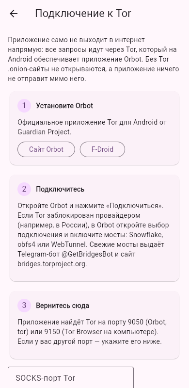
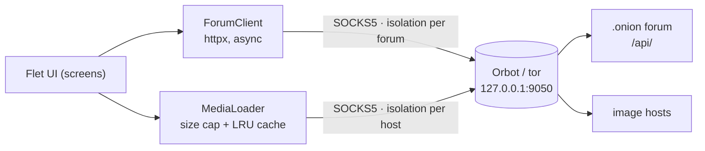

# Tor Forum Client

[](https://github.com/Holego/tor-forum-client/actions/workflows/ci.yml)
[](https://github.com/Holego/tor-forum-client/actions/workflows/android.yml)

A mobile client for forums hosted as Tor onion services, written in Python.
Read topics, reply, start threads and chat in private messages — every byte goes
through Tor, and images/GIFs linked in posts are fetched through Tor as well.

Works with any forum that implements the small [Tor Forum API](#forum-api)
(for example [Jo Pirat Forum](https://github.com/Holego/jo-pirat-forum), which comes preset).

<p>
  
  
  
  
  
</p>

## Коротко по-русски

1. Установите [Orbot](https://orbot.app/) (Tor для Android), откройте и нажмите «Подключиться».
   Если Tor заблокирован провайдером — включите в Orbot мосты (Snowflake, obfs4 или WebTunnel;
   свежие мосты выдаёт Telegram-бот @GetBridgesBot).
2. Скачайте APK из [Releases](https://github.com/Holego/tor-forum-client/releases):
   для большинства телефонов нужен файл `arm64-v8a`.
3. Откройте **Tor Forum** — Jo Pirat Forum уже в списке. Другой форум добавляется кнопкой «+ Форум»
   по .onion-адресу.

## Features

- **Tor only, no fallback.** Remote sites are reachable exclusively through the local Tor SOCKS proxy
  (Orbot on Android, `tor` or Tor Browser on desktop, detected automatically). If Tor is down the app
  shows how to start it — it never retries without Tor.
- **Forums:** categories, topics (pinned/locked), paginated posts, replying, new topics, login/registration,
  private messages with unread badges.
- **Media by link:** direct links to images/GIFs in posts are downloaded through Tor and shown inline;
  video/audio links become tiles you can copy.
- **Onion address checks:** pasted addresses are normalized, and v3 addresses are verified with their
  built-in SHA3 checksum, so a typo is caught before any connection is made.
- Material 3 UI with light/dark theme; the same code runs on Android, desktop and in a browser.

## How it works



Privacy details that are enforced in code and covered by tests:

| | |
|---|---|
| No direct connections | `build_http_client()` refuses to create a client for a remote host without a Tor port; only `localhost` (a forum you run yourself) is reached directly. |
| No DNS leaks | Hostnames are sent to Tor inside the SOCKS5 request (remote resolution) — `tests/test_routing.py` runs the client against a fake SOCKS5 server and asserts the proxy receives the `.onion` name. |
| Stream isolation | Each forum and each image host gets its own SOCKS credentials, so Tor puts them on separate circuits (`IsolateSOCKSAuth`). |
| Safe media | Images are streamed with a hard size limit (also without `Content-Length`), checked by magic bytes rather than `Content-Type`, and redirects never leave the Tor route. |
| Links aren't opened in a browser | Tapping a link copies it: an ordinary browser would load it outside Tor. |

## Running from source

Requires Python 3.12+ and [uv](https://docs.astral.sh/uv/).

```bash
uv sync                           # app + dev tools (Flet desktop/web runner, pytest, ruff)
uv run flet run src/main.py       # desktop window
uv run flet run --web src/main.py # or in a browser
```

Start Tor first (`tor`, or Tor Browser which listens on 9150). To work on the UI against a forum running
on your own machine, add `http://127.0.0.1:8000` as a forum — local addresses don't need Tor.

## Tests

```bash
uv run pytest     # 80+ tests: address parsing, SOCKS detection, routing through a fake Tor, API client, media
uv run ruff check . && uv run ruff format --check .
```

The API client is tested with [respx](https://lundberg.github.io/respx/); the Tor routing tests start a
minimal SOCKS5 server (`tests/fake_socks.py`) that records what the client asks the proxy for.

## Building the Android app

```bash
uv run flet build apk     # installs Flutter / Android SDK on first run if needed
```

CI does the same on every push to `main` (APK attached to the workflow run) and publishes the APKs to
a GitHub release when you push a tag:

```bash
git tag v0.1.0 && git push origin v0.1.0
```

**Signing.** Without a key, each CI build is signed with a throwaway debug key, so a new version can't be
installed over an old one. To sign with your own key, create it once and add it as repository secrets:

```bash
keytool -genkey -v -keystore upload.jks -keyalg RSA -keysize 2048 -validity 10000 -alias upload
base64 -w0 upload.jks   # → ANDROID_KEYSTORE_BASE64
```

Secrets: `ANDROID_KEYSTORE_BASE64`, `ANDROID_KEYSTORE_PASSWORD`, `ANDROID_KEY_PASSWORD`, `ANDROID_KEY_ALIAS`.

## Forum API

A forum works with the app if it serves JSON under `/api/` (reference implementation: Django REST Framework in
[jo-pirat-forum](https://github.com/Holego/jo-pirat-forum#api)):

| Method | Endpoint | |
|---|---|---|
| GET | `/api/` | `{"api": "tor-forum", "version": 1, "name": ...}` — how the app recognises a supported forum |
| POST | `/api/auth/login/`, `/api/auth/register/` | `{username, password}` → `{token, user}` |
| POST | `/api/auth/logout/` | revokes the token |
| GET | `/api/me/` | current user and unread message count |
| GET | `/api/categories/` | categories |
| GET, POST | `/api/categories/<slug>/topics/` | paginated topics; POST `{title, body}` |
| GET | `/api/topics/<id>/` | topic |
| GET, POST | `/api/topics/<id>/posts/` | paginated posts with `embeds` (`[{kind, url}]`); POST `{body}` |
| GET | `/api/messages/` | conversations |
| GET, POST | `/api/messages/<username>/` | a conversation; POST `{body}` |

Requests are authenticated with `Authorization: Token <key>`; pagination follows DRF's
`{count, next, previous, results}`.

## Project layout

```
src/
  main.py               entry point (flet run / flet build)
  torforum/
    tor.py              find the Tor SOCKS port, per-site isolation credentials
    onion.py            address normalisation, v3 checksum validation
    api.py              async API client and user-facing errors
    models.py           typed dataclasses for API JSON
    media.py            image downloads through Tor, size cap, LRU cache
    storage.py          saved forums and logins (SharedPreferences)
    text.py             link splitting, relative time, Russian plurals
    ui/                 Flet screens: home, forum, account, messages
tests/                  pytest suite, fake SOCKS5 server
```

## Stack

Python 3.12 · [Flet](https://flet.dev) (Flutter UI from Python) · [httpx](https://www.python-httpx.org/)
with SOCKS · pytest / pytest-asyncio / respx · ruff · uv · GitHub Actions

## License

[MIT](LICENSE)
