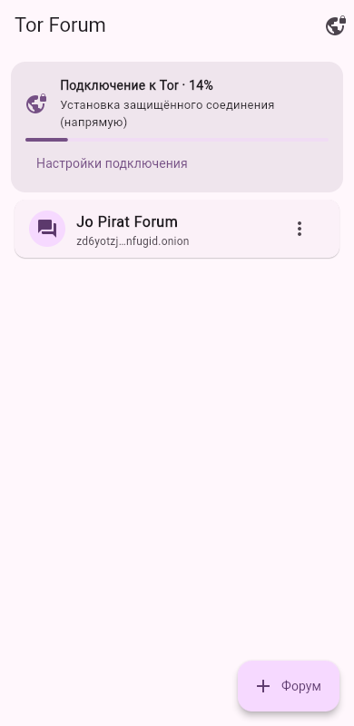
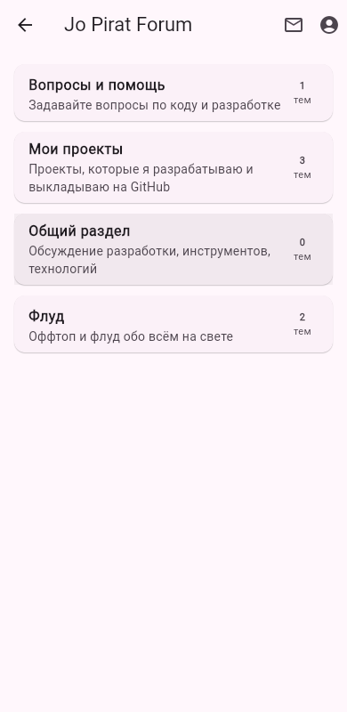
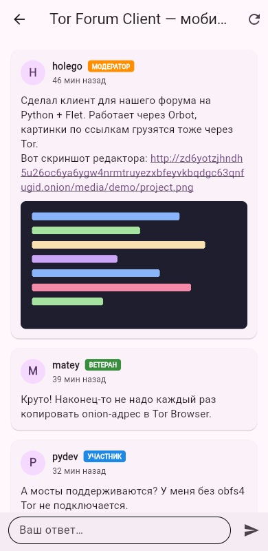
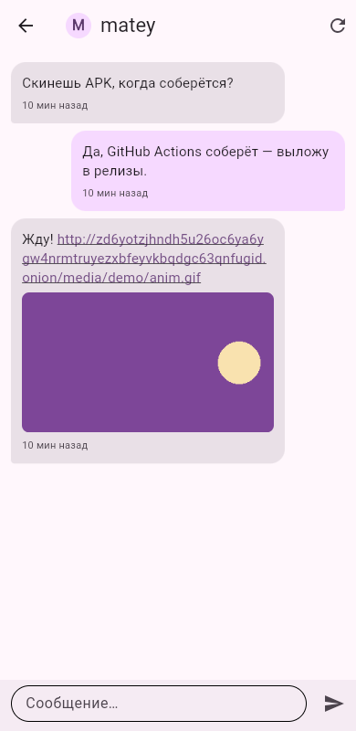
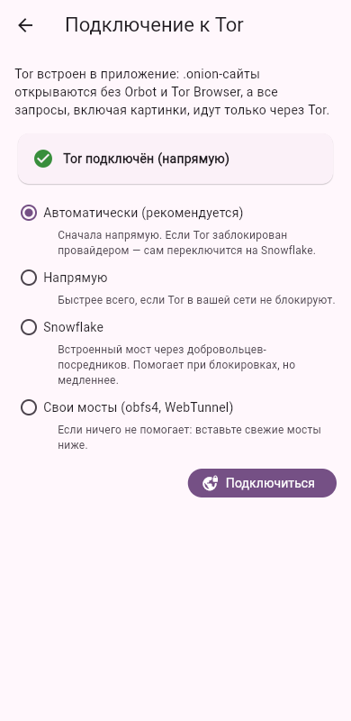
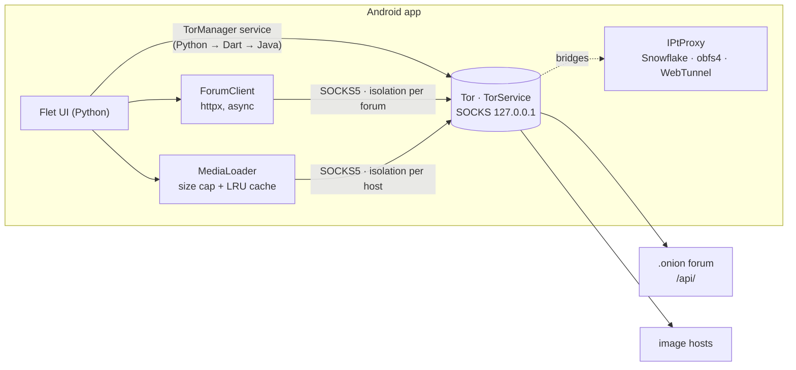

# Tor Forum Client

[](https://github.com/Holego/tor-forum-client/actions/workflows/ci.yml)
[](https://github.com/Holego/tor-forum-client/actions/workflows/android.yml)

A mobile client for forums hosted as Tor onion services, written in Python.
Tor is built into the app — no Orbot or Tor Browser needed, and it can connect through
Snowflake, obfs4 or WebTunnel bridges where Tor is blocked. Read topics, reply, start threads and
chat in private messages; images/GIFs linked in posts are fetched through Tor as well.

Works with any forum that implements the small [Tor Forum API](#forum-api)
(for example [Jo Pirat Forum](https://github.com/Holego/jo-pirat-forum), which comes preset).

<p>
  
  
  
  
  
</p>

## Features

- **Tor built in.** On Android the app runs Tor itself ([tor-android](https://github.com/guardianproject/tor-android))
  and shows bootstrap progress; on desktop it uses a running `tor` or Tor Browser. Remote sites are only ever
  reached through Tor — there is no fallback to a direct connection.
- **Works where Tor is blocked.** Connection modes: automatic (direct, switching to Snowflake if Tor looks
  blocked), direct, Snowflake, or your own obfs4/WebTunnel bridges — pluggable transports come from
  [IPtProxy](https://github.com/tladesignz/IPtProxy). Bridges are changed at runtime over Tor's control
  connection, like Tor Browser does.
- **Forums:** categories, topics (pinned/locked), paginated posts, replying, new topics, login/registration,
  private messages with unread badges.
- **Media by link:** direct links to images/GIFs in posts are downloaded through Tor and shown inline;
  video/audio links become tiles you can copy.
- **Onion address checks:** pasted addresses are normalized, and v3 addresses are verified with their
  built-in SHA3 checksum, so a typo is caught before any connection is made.
- Material 3 UI with light/dark theme; the same code runs on Android, desktop and in a browser.

## How it works



`packages/flet_tor` is a small Flet extension: a Python `Service`, a Dart `FletService` and an Android
plugin in Java. Tor starts with `DisableNetwork 1` and a `ClientTransportPlugin` for every IPtProxy
transport; connecting is a `SETCONF UseBridges/Bridge …` + `DisableNetwork 0` over the control
connection, so switching bridges never needs a Tor restart. The Python side (`torforum/embedded.py`)
follows `status/bootstrap-phase` and, in automatic mode, falls back to Snowflake when a direct
connection doesn't get past 25 % within 40 s.

Privacy details that are enforced in code and covered by tests:

| | |
|---|---|
| No direct connections | `build_http_client()` refuses to create a client for a remote host without a Tor port; only `localhost` (a forum you run yourself) is reached directly. |
| No DNS leaks | Hostnames are sent to Tor inside the SOCKS5 request (remote resolution) — `tests/test_routing.py` runs the client against a fake SOCKS5 server and asserts the proxy receives the `.onion` name. |
| Stream isolation | Each forum and each image host gets its own SOCKS credentials, so Tor puts them on separate circuits (`IsolateSOCKSAuth`). |
| Safe media | Images are streamed with a hard size limit (also without `Content-Length`), checked by magic bytes rather than `Content-Type`, and redirects never leave the Tor route. |
| Links aren't opened in a browser | Tapping a link copies it: an ordinary browser would load it outside Tor. |

## Running from source

Requires Python 3.12+ and [uv](https://docs.astral.sh/uv/).

```bash
uv sync                           # app + dev tools (Flet desktop/web runner, pytest, ruff)
uv run flet run src/main.py       # desktop window
uv run flet run --web src/main.py # or in a browser
```

On desktop, start Tor first (`tor`, or Tor Browser which listens on 9150); the built-in Tor is Android-only.
To work on the UI against a forum running on your own machine, add `http://127.0.0.1:8000` as a forum —
local addresses don't need Tor.

## Tests

```bash
uv run pytest     # 100+ tests: addresses, bridges, bootstrap/fallback logic, routing through a fake Tor, API, media
uv run ruff check . && uv run ruff format --check .
```

The API client is tested with [respx](https://lundberg.github.io/respx/); the Tor routing tests start a
minimal SOCKS5 server (`tests/fake_socks.py`) that records what the client asks the proxy for.

## Building the Android app

```bash
uv run flet build apk     # installs Flutter / Android SDK on first run if needed
```

CI does the same on every push to `main`, then installs the x86_64 APK on an Android emulator, launches it
and waits until the built-in Tor reports `PROGRESS=100` — so every build is checked to actually connect.
Pushing a tag publishes the APKs to a GitHub release:

```bash
git tag v0.1.0 && git push origin v0.1.0
```

**Signing.** Without a key, each CI build is signed with a throwaway debug key, so a new version can't be
installed over an old one. To sign with your own key, create it once and add it as repository secrets:

```bash
keytool -genkey -v -keystore upload.jks -keyalg RSA -keysize 2048 -validity 10000 -alias upload
base64 -w0 upload.jks   # → ANDROID_KEYSTORE_BASE64
```

Secrets: `ANDROID_KEYSTORE_BASE64`, `ANDROID_KEYSTORE_PASSWORD`, `ANDROID_KEY_PASSWORD`, `ANDROID_KEY_ALIAS`.

## Forum API

A forum works with the app if it serves JSON under `/api/` (reference implementation: Django REST Framework in
[jo-pirat-forum](https://github.com/Holego/jo-pirat-forum#api)):

| Method | Endpoint | |
|---|---|---|
| GET | `/api/` | `{"api": "tor-forum", "version": 1, "name": ...}` — how the app recognises a supported forum |
| POST | `/api/auth/login/`, `/api/auth/register/` | `{username, password}` → `{token, user}` |
| POST | `/api/auth/logout/` | revokes the token |
| GET | `/api/me/` | current user and unread message count |
| GET | `/api/categories/` | categories |
| GET, POST | `/api/categories/<slug>/topics/` | paginated topics; POST `{title, body}` |
| GET | `/api/topics/<id>/` | topic |
| GET, POST | `/api/topics/<id>/posts/` | paginated posts with `embeds` (`[{kind, url}]`); POST `{body}` |
| GET | `/api/messages/` | conversations |
| GET, POST | `/api/messages/<username>/` | a conversation; POST `{body}` |

Requests are authenticated with `Authorization: Token <key>`; pagination follows DRF's
`{count, next, previous, results}`.

## Project layout

```
src/
  main.py               entry point (flet run / flet build)
  torforum/
    tor.py              find the Tor SOCKS port, per-site isolation credentials
    onion.py            address normalisation, v3 checksum validation
    api.py              async API client and user-facing errors
    models.py           typed dataclasses for API JSON
    media.py            image downloads through Tor, size cap, LRU cache
    storage.py          saved forums and logins (SharedPreferences)
    text.py             link splitting, relative time, Russian plurals
    bridges.py          connection modes, built-in Snowflake bridges, bridge-line validation
    embedded.py         drives the built-in Tor through bootstrap, auto-fallback to Snowflake
    ui/                 Flet screens: home, connection, forum, account, messages
packages/flet_tor/      Flet extension: Tor + pluggable transports inside the Android app (Python/Dart/Java)
tests/                  pytest suite, fake SOCKS5 server
```

## Stack

Python 3.12 · [Flet](https://flet.dev) (Flutter UI from Python) · [httpx](https://www.python-httpx.org/)
with SOCKS · tor-android · IPtProxy · pytest / pytest-asyncio / respx · ruff · uv · GitHub Actions

## License

[MIT](LICENSE)
